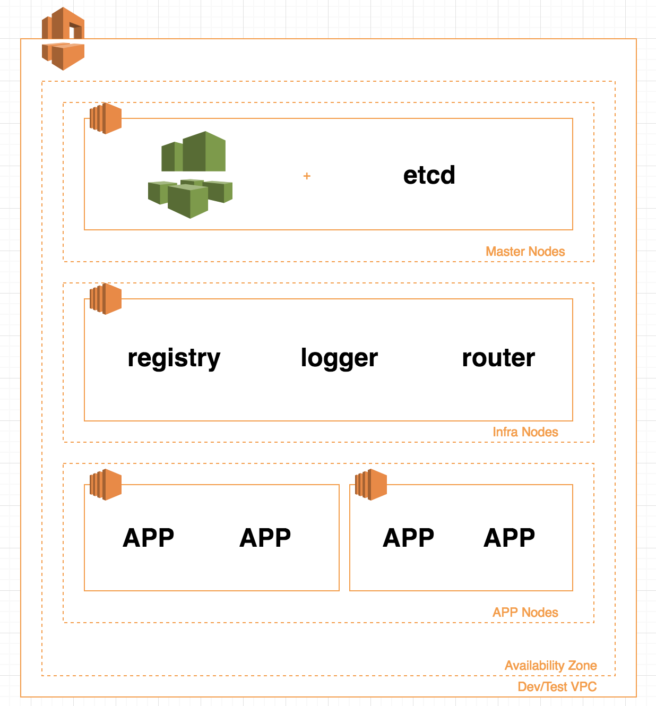
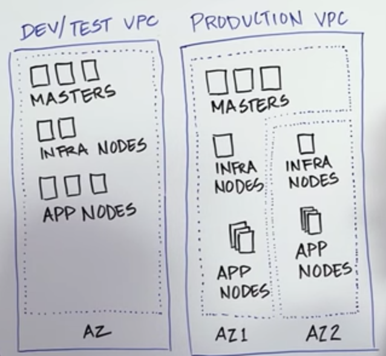
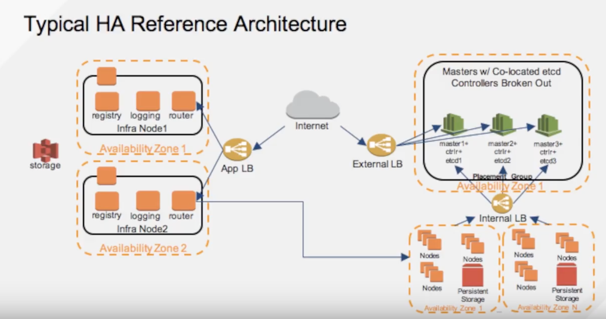

# Install Openshift on AWS using terraform and ansible scripts
Goal of this project to automate openshift installation AWS along with New VPC

## Chapter 1: End goal of Chapter 1 ( Dev insfra setup)

# References from Redhat Conferences:
## Blueprint of deployment architecture in AWS for Dev/Prod environments

## Typical HA deployment architecture

# Commands to create OS origin in AWS in Single Avaliability Zone

terraform get && terraform apply
sed "s/\${aws_instance.master.public_ip}/$(terraform output master-public_ip)/" inventory.template.cfg > inventory.cfg
ssh-add ~/.ssh/id_rsa
scp ./inventory.cfg ec2-user@$(terraform output bastion-public_dns):~
cat install-from-bastion.sh | ssh -A ec2-user@$(terraform output bastion-public_dns)
terraform destroy